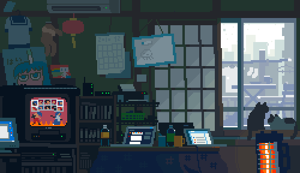

<h1> Hi, I’m Manh Hung. Nice to see you!</h1>

  

- 👀 I’m interested in software engineering, particularly in developing innovative solutions and optimizing system performance.
- 🌱 I’m currently learning advanced algorithms, cloud computing, and machine learning techniques.
- 💞️ I’m looking to collaborate on projects that involve building efficient software systems and enhancing software performance.
- 🗞️ I'm writing some article about algorithms, learning journey, technical and lifestyle. Follow me at [Jine.Blog](https://jine.blog/)
- 👋 How to reach me: You can contact me via email at [@jinergenkai](mailto:jinergenkai@gmail.com) or connect with me on [LinkedIn](https://www.linkedin.com/in/jinergenkai/).


[](https://leetcode.com/Jinergenkai/) 

[]()
```
    ／))        /)／)
   (・   )o    (・   )o
"JinerGenkai - Just Grow"
```


<!---
jinergenkai/jinergenkai is a ✨ special ✨ repository because its `README.md` (this file) appears on your GitHub profile.
You can click the Preview link to take a look at your changes.
say oh yeah
--->
